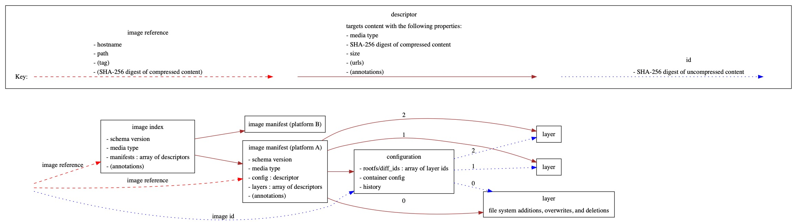

[](https://travis-ci.org/naqvis/containerregistry.cr)
[](https://github.com/naqvis/containerregistry.cr/releases)
[](https://naqvis.github.io/containerregistry.cr/)

# Crystal - Container Registry Shard

`containerregistry.cr` shard is a library for working with container registries. It's largely based on the [Go library of the same name](https://github.com/google/go-containerregistry).

The following diagram shows the main types that this library handles.


## Installation

1. Add the dependency to your `shard.yml`:

   ```yaml
   dependencies:
     containerregistry:
       github: naqvis/containerregistry.cr
   ```

2. Run `shards install`

## Usage

```crystal
require "containerregistry"
```
Refer to [`opal`](https://github.com/naqvis/opal) for CLI and usage

## Development

To run all tests:

```
crystal spec
```

## Contributing

1. Fork it (<https://github.com/naqvis/containerregistry.cr/fork>)
2. Create your feature branch (`git checkout -b my-new-feature`)
3. Commit your changes (`git commit -am 'Add some feature'`)
4. Push to the branch (`git push origin my-new-feature`)
5. Create a new Pull Request

## Contributors

- [Ali Naqvi](https://github.com/naqvis) - creator and maintainer
